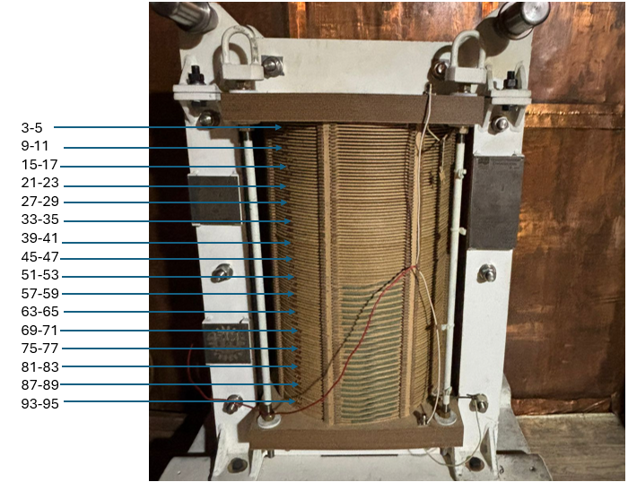
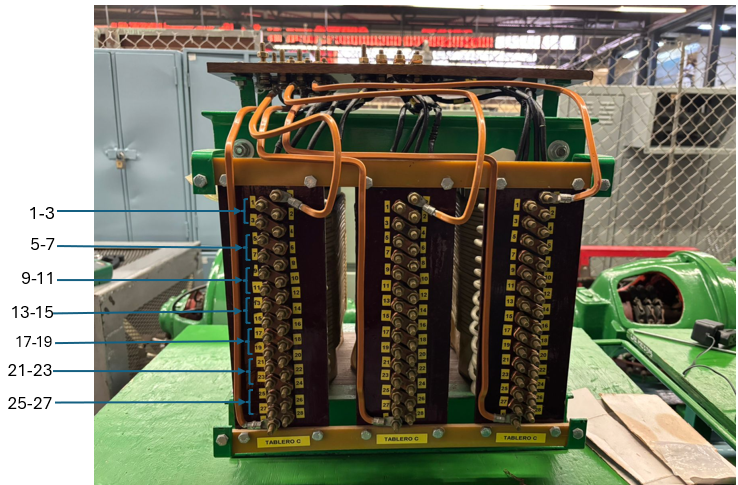

# ⚡ Análisis de Fallas en Transformadores mediante SFRA


Este repositorio contiene los códigos fuente y los datos experimentales para el análisis de la **Respuesta en Frecuencia de Barrido (SFRA)** en devanados de transformadores. El estudio se centra en el diagnóstico de problemas mecánicos y eléctricos (cortocircuitos francos y resistivos) mediante técnicas de correlación estadística.


---

## 🏗️ Estructura del Repositorio

El proyecto distingue claramente entre la lógica de programación (`src`) y los archivos de entrada (`data`) para mantener un flujo de trabajo ordenado.

Se analizaron 2 casos: Uno sobre un devanado de tipo continuo de 2000 vueltas, sin secundario y de tipo experimental. Otro sobre un transformador de distribución de 15 kvA, estrella-delta, con un tipo de nucleo de columna de tres piernas.

<p align="center">
  
  
  
</p>
<p align="center">
  <em>Fig 1. Izquierda: Devanado experimental (Caso 1). Derecha: Transformador de 15 kVA (Caso 2).</em>
</p>

Al caso 1 en configuracion de circuito abierto, se le introdujeron cortocircuitos de tipo resistivos para la simulacion de fallas iniciales, tambien fallas de tipo franco para observar el comportamiento ante una falla grave. 
Mientras que, al caso 2 en configuración de cortocirccuito y circuito abierto, se le simularon fallas de tipo capacitivo simulando un acercamiento de las espiras del devanado.

### 1. ⚙️ `src-codigos/`
*Scripts de procesamiento de señales y cálculo de índices de falla.*

* **`SFRA_transformado_trif.m`** 🔌  
    * **Caso 2: Análisis de transormador trifásico:** Genera la "huella digital" del transformador completo. Procesa magnitud (dB) y fase para las tres columnas del núcleo.
* **`SFRA_Comparacion_fases.m`** 📉  
    * **Análisis de 2 fases del transormador trifásico:** Algoritmos de comparación cruzada. Calcula desviaciones entre fases (A,B) para detectar asimetrías.
* **`SFRA_Devanado_exp.m`** 🧪  
    * **Caso 1: Devanado experimental:** Análisis focalizado en el devanado experimental con fallas inducidas controladas.

### 2. 💾 `data-datos_experimentales/`
*Registros de medición en formato **Touchstone (.s2p)** obtenidos vía VNA.*

* 📁 **Archivos `.S2P`:** Contienen los parámetros de dispersión ($S_{21}$ o función de transferencia) en frecuencia.
* 📊 **Datasets incluidos:**
    * Cortocircuito Franco (Baja impedancia).
    * Cortocircuito Resistivo (Simulación de falla incipiente $R=10\Omega$).
    * Pruebas de Circuito Abierto/Corto (simulación de acercamiento de espiras).

---

## 📘 Descripción Detallada de los Algoritmos

### 1. `SFRA_Comparacion_fases.m`

**Objetivo:** Comparación de simetría entre fases.

Este script carga dos archivos de referencia para evaluar su similitud gráfica, dibujando automáticamente las zonas de frecuencia según el estándar **IEEE C57.149-2012**.

<details>
<summary><b>Ver código: Definición de Zonas IEEE</b></summary>

```matlab
%% === Definir zonas de frecuencia ===
% Se definen los límites de las zonas (Baja, Media, Alta frecuencia)
zonasFrecuencia = [min(frecuencia) 2e3;
                   2e3              20e3;
                   20e3             1e6;
                   1e6              max(frecuencia)];

%% === Función auxiliar: dibujar zonas ===
function dibujarZonas(zonas, posY, freqDatos)
    % Dibuja líneas verticales rojas en los límites
    for i = 2:size(zonas,1)
        xline(zonas(i,1), '--r', '', 'LineWidth', 2, 'HandleVisibility','off');
    end
    % ... (configuración de etiquetas y ejes)
end
```
</details>

-----

### 2. `SFRA_Devanado_exp.m`

**Objetivo:** Análisis de devanado experimental con fallas progresivas.

Evalúa el comportamiento de un devanado bajo distintas condiciones de falla (discos), identificando automáticamente **5 resonancias clave** y generando visualizaciones avanzadas.

<details>
<summary><b>Ver código: Detección y Rastreo de 5 Resonancias</b></summary>

```matlab
% Loop principal para identificar las 5 resonancias en Referencia y Fallas
for nRes = 1:5
    % Inicialización de tabla de resultados
    resTbl = table('Size',[0 5], ...); 
    
    for k = 0:numArchivosFalla
        % Lógica de búsqueda de picos (findpeaks) según el número de resonancia
        switch nRes
            case 1 % Resonancia 1: Búsqueda de mínimos
                [~, locsMin] = findpeaks(-mag_dB,'MinPeakProminence',prominenceMin);
                if ~isempty(locsMin), idx_pico = locsMin(1); end
            
            case 2 % Resonancia 2: Búsqueda condicionada al rango de la Res 1
                if ~isempty(resAll{1}) && ~isnan(resAll{1}.Freq1_Hz(k+1))
                    fR1 = resAll{1}.Freq1_Hz(k+1);
                    idx_rango = find(freqData>fR1 & freqData<=38e3);
                    % ... (código de detección)
                end
            % ... (casos para resonancias 3, 4 y 5)
        end
    end
end
```
</details>

<details>
<summary><b>Ver código: Generación de Superficie 3D</b></summary>

```matlab
%% === Superficie 3D SFRA incluyendo referencia ===
[X,Y] = meshgrid(frecuenciaRef, discos);
fig3D = figure('Name','SFRA 3D - Referencia y Fallas'); hold on;

% Dibujar superficie con transparencia (FaceAlpha) y sin bordes de malla
hSurf = surf(X,Y,Z,'EdgeColor','none','FaceAlpha',0.95);

set(gca,'XScale','log');
colormap('parula'); shading interp; colorbar;
view(45,25); grid on;
xlabel('Frecuencia [Hz]'); ylabel('Disco'); zlabel('Magnitud [dB]');
```
</details>

<details>
<summary><b>Ver código: Correlación de Pearson</b></summary>

```matlab
%% === Correlación Pearson excluyendo referencia ===
for nRes = 1:5
    T = resAll{nRes};
    % Filtrar solo datos de fallas (Disco ~= 0)
    resFallas = T(T.Disco~=0 & ~isnan(T.(['Mag' num2str(nRes) '_dB'])), :);
    
    discosF = resFallas.Disco;
    mag = resFallas.(['Mag' num2str(nRes) '_dB']);

    % Calcular coeficiente 'corr' omitiendo valores NaN
    if numel(discosF)>=2
        corrTbl.Corr_Mag(nRes) = corr(discosF, mag,'Rows','complete');
        corrTbl.Corr_Freq(nRes)= corr(discosF, freq,'Rows','complete');
        corrTbl.Corr_Angulo(nRes)= corr(discosF, ang,'Rows','complete');
    end
end
```
</details>

-----

### 3. `SFRA_transformado_trif.m`

**Objetivo:** Diagnóstico de Transformadores Trifásicos.

Adaptado para transformadores comerciales. Permite alternar entre análisis de **Circuito Abierto** y **Cortocircuito** modificando los rangos de frecuencia en el código.

<details>
<summary><b>Ver código: Selección de Rangos (Abierto/Corto)</b></summary>

```matlab
% === Configuración de Rangos de Frecuencia ===

% Opción A: Rangos para Circuito Abierto (Activo)
rangosRef = [ 0       2.5e6; 2.5e6   5.5e6; 5.5e6   8.4e6];
rangosFalla = [0       610e3; 610e3   900e3; 900e3   2.4e6];

%{
% Opción B: Rangos para Circuito Corto (Comentar bloque anterior para usar este)
rangosRef = [ 0       620e3; 620e3  1.3e6; 1.3e6   3e6];
rangosFalla = [0       390e3; 390e3   1.3e6; 1.3e6  3.5e6];
%}
```
</details>

<details>
<summary><b>Ver código: Gráficas de Tendencia con Ajuste Lineal</b></summary>

```matlab
%% === Subplots de tendencia por resonancia ===
% --- Magnitud ---
subplot(3,1,1); hold on; grid on;
scatter(resValidos.Disco, resValidos.Magnitud_dB, tamanioMarker, 'k', 'filled');

% Calcular y graficar línea de tendencia (polyfit de grado 1)
if height(resSinRef)>=2 && numel(unique(resSinRef.Disco))>1
    p = polyfit(resSinRef.Disco, resSinRef.Magnitud_dB, 1);
    plot(resSinRef.Disco, polyval(p, resSinRef.Disco), 'k--', 'LineWidth', 2);
end
xlabel('Disco'); ylabel('Magnitud [dB]');
```
</details>

-----

## 🛠️ Requisitos del Sistema

  * **MATLAB** (R2020b o superior recomendado).  
  * **RF Toolbox:** Necesaria para la función `sparameters` (lectura de archivos .s2p) y `rfparam`.  
  * **Signal Processing Toolbox:** Recomendada para `findpeaks` y `smooth`.

-----

## 📝 Nomenclatura de Archivos

Los archivos experimentales siguen una codificación sistemática (ej. `23072501.S2P`) basada en la fecha de la prueba y el tipo de falla inducida.

**Importante:** Para interpretar correctamente el significado de cada archivo (tipo de conexión, número de espiras en corto, fase analizada, etc.), consulte los archivos de texto de referencia (`Nomenclatura*.txt`) que se encuentran alojados dentro de la carpeta `data-datos_experimentales`.

-----

## 🚀 Instrucciones de Uso

Para ejecutar los análisis, es necesario vincular la carpeta de datos con los scripts de código.

1. **Clonar el repositorio:**
    ```bash
    git clone https://github.com/4lassky/SFRA-Efectos-Falla-Entre-Espiras.git
    ```
2. **Abrir MATLAB** y situarse en la carpeta `src-codigos`.
3. **Configurar el Path:**  
   Los scripts requieren acceso a la carpeta de datos. Puede agregar la ruta manualmente o ejecutar en la consola de MATLAB:
    ```matlab
    addpath('../data-datos_experimentales');
    savepath;
    ```
4. **Ejecutar el análisis:**  
   Abra `SFRA_transformado_trif.m` (o cualquier otro script) y ejecute el código (`F5`) para visualizar las curvas de respuesta.

-----
## 👥 Créditos y Autores

Este proyecto de investigación y desarrollo de software fue ejecutado por:

| Investigador | Rol |
| :--- | :--- |
| **Herrera Godoy Hazael** | Investigación, Desarrollo de Algoritmos y Análisis Experimental |
| **Galindo Barbosa Israel Aldahir** | Investigación, Desarrollo de Algoritmos y Análisis Experimental |

-----

## 🎓 Citar este trabajo

Si utilizas este código o los datos experimentales en tu investigación, por favor cita el repositorio utilizando el formato adecuado:

**BibTeX (para LaTeX):**
```bibtex
@software{SFRA_Fallas_2025,
  author = {Herrera Godoy, Hazael and Galindo Barbosa, Israel Aldahir},
  title = {Efecto de una falla entre espiras en la respuesta en frecuencia de devanados de transformadores},
  year = {2025},
  publisher = {GitHub},
  journal = {GitHub repository},
  url = {[https://github.com/4lassky/SFRA-Efectos-Falla-Entre-Espiras](https://github.com/4lassky/SFRA-Efectos-Falla-Entre-Espiras)}
}
```
----

## 📄 Licencia

Este proyecto está bajo la Licencia MIT - ver el archivo [LICENSE](https://www.google.com/search?q=LICENSE) para más detalles.
